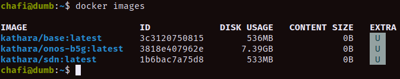
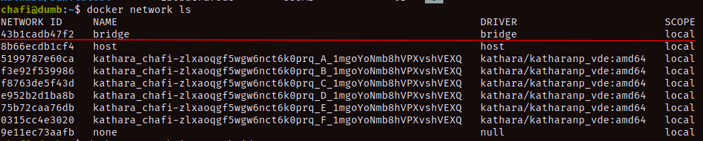
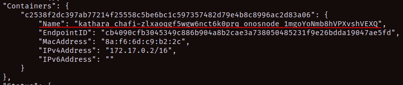
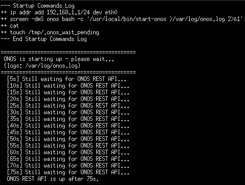
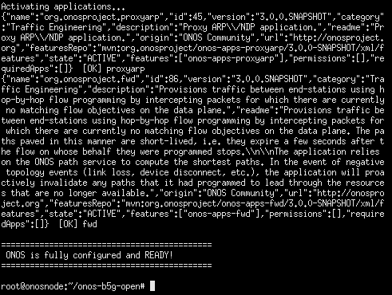
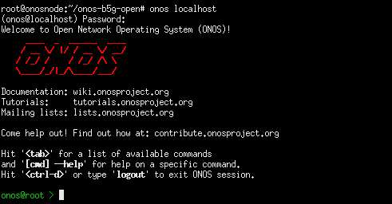
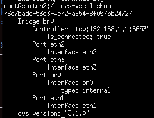
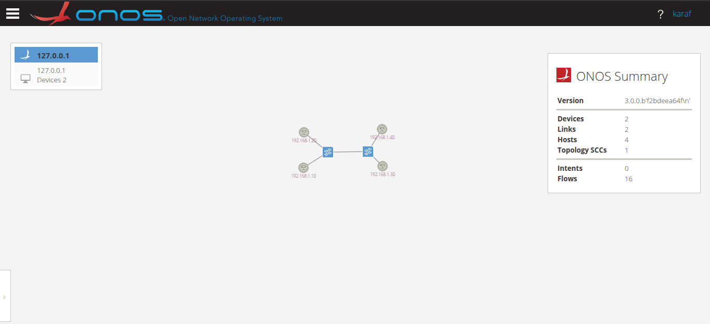

# About

This tutorial explains how we can create a standalone image featuring `Kathara` and `ONOS`. This work is inspired **by Professor Alessio Giorgetti, DII, University of Pisa**. I hope this tool is of great help.

> **Note:** There is an automated script that will execute all these steps in one shot. If you are using this for coursework, you can also use that script.

## Create from Scratch

Run the following command to build the image from scratch:

```bash
# From the directory: katharaXonos/
docker build -t kathara/onos-b5g . --no-cache
```

Once the image is built, test the following scenarios to ensure everything is working correctly:

1. **Creating a container and connecting to its shell:**
   - Make sure to expose the necessary ports for the ONOS Web UI (`8181`) and SSH (`8101`):

      ```bash
      docker run -it --rm -p 8181:8181 -p 8101:8101 --name kathara-onos-test kathara/onos-b5g /bin/bash

      ```

   - However, in our setup, we have configured `ssh` connectivity natively within the container, and we will connect to the `ONOS CLI` from there. So, use this command to run the container for our specific use case:

      ```bash
      docker run -it --rm -p 8181:8181 --name kathara-onos-test kathara/onos-b5g /bin/bash

      ```

   - Test external connectivity from inside the container:

      ```bash
      ping google.com

      ```

2. **Verifying Kathará base networking tools:**

   - From inside the container shell, verify that the standard networking and system tools inherited from the `kathara/core` base image are available:

      ```bash
      # Check networking utilities
      ip a
      iptables --version
      tcpdump --version
      ping -V

      ```

3. **Verifying Python, NetworkX, and Java environments:**

      ```bash
      # Verify Java (should be OpenJDK / Temurin 11)
      java -version

      # Verify Python 2 (required for Bazel ONOS toolchains)
      python2 -V

      # Verify Python 3 and NetworkX
      python3 -V
      python3 -c "import networkx as nx; print(f'NetworkX version: {nx.__version__}')"

      ```

4. **Verifying Bazel & ONOS installation:**

      ```bash
      # Verify Bazel version
      bazel version

      # Verify ONOS source folder
      ls -la $ONOS_ROOT

      ```

5. **Starting and testing ONOS:**

   - Run the preconfigured helper script to start ONOS:

      ```bash
      start-onos

      ```

   - Once ONOS has booted up, test accessing the ONOS CLI:

      ```bash
      source $ONOS_ROOT/tools/dev/bash_profile
      onos onos@localhost

      ```

      *(Default credentials: user `onos`, password `rocks`)*
6. **Web UI**

   - `ONOS` is exposed to our localhost's 8181 port. Navigate to `http://localhost:8181/onos/ui` in your web browser to access the GUI. Use **`onos`** as the username and **`rocks`** as the password to log in.

   - If you have completed all these steps, you now have a working version of an ONOS node built directly on top of the `kathara/core` image. By using this custom image, we can spawn a `controller` node within Kathará that completely bypasses the host machine's `iptables` firewall. This works because the controller is spawned natively as a Kathará node and its traffic is strictly managed within an isolated Kathará collision domain.

   - The following tutorial will explain how to set up a linear topology with 2 `ovs-switches`, 2 hosts, and an SDN Controller (ONOS) using Kathará.

## For the Lab

1. **Setting up Kathará:**

   - Set up `Kathará` by following these [steps](../practice/README.md).

2. **Setting up the Lab:**

   - Execute the [startKatharaXonos.sh](./startKatharaXonos.sh) script:

      ```bash
      # If the image is missing and needs to be built
      bash startKatharaXonos.sh build

      # If the image is already built
      bash startKatharaXonos.sh run

      ```

## How Does Everything Work Under the Hood?

1. **Creating `onosnode` using Kathará:**

   - When we executed the `startKatharaXonos.sh` script, it built an image containing ONOS directly on top of `kathara/core`. This ensures that the ONOS and Kathará environments seamlessly coexist. Any OpenFlow traffic traveling from a Kathará switch node to ONOS will no longer be intercepted by the host Linux machine's firewall. Instead, it travels strictly through Kathará's virtual Layer-2 LANs (collision domains). If we check the Docker images using the `docker images` command, we will find `kathara/onos-b5g` on the list:

      

2. **Setting up `lab.conf`:**

   - Now that we have the `kathara/onos-b5g` image, we can define it within Kathará to launch our ONOS SDN Controller. *(Note: In my case, Kathará is installed in a virtual Python environment. Your setup may vary slightly, but the ultimate goal is to have the Kathará executable ready to parse our `lab.conf` scripts).*

   - In our [lab.conf](../practice/onos-ovs/lab.conf), we have the following setup for `onosnode`:

      ```text
      onosnode[image]="kathara/onos-b5g"
      onosnode[bridged]=true
      onosnode[port]="8181:8181/tcp"
      onosnode[0]="A"
      ```

### What did we do here?

1. `onosnode[image]="kathara/onos-b5g"`: Specified our custom image for the controller node.
2. `onosnode[bridged]=true`: By default, Kathará strictly isolates its nodes into closed collision domains. Because we need to expose the 8181 port to our localhost, we must bind the node to Docker's default NAT bridge network. To validate this, we can inspect our networks using the command `docker network ls`:

   

3. If we inspect the `bridge` network using the command `docker network inspect bridge`:

   

   We can see that the `onosnode` container is listed under that network. This ensures that web traffic can be routed to the host machine. ***Take note of the `IP: 172.17.0.2/16` that the container acquired from this specific bridge network.***
4. Next, we defined the `ovs-switches` and `hosts` in the configuration. The critical step is assigning them to specific `collision domains`. This `collision domain` architecture is the core feature that allows Kathará to emulate physical Layer-2 wiring.

5. If we look at [onosnode.startup](../practice/onos-ovs/onosnode.startup), we can see a couple of custom commands. These are essential for automation:

   - ONOS goes through a sequence of heavy initialization steps before starting up. Because we are booting it unattended as a Kathará node, we had to ensure those steps execute cleanly.
   - To solve this, I designed a loop that puts the terminal on hold until ONOS is fully booted, the necessary REST API apps are activated, and the port mapping is complete.
   - This is why, when we execute [lab.conf](../practice/onos-ovs/lab.conf), a terminal window pops up showing these status steps:
   - `ONOS` booting up:

      

   - `ONOS` ready:

      

   - Once ONOS is ready, the script releases the terminal back to your control.
   - From that terminal, you can execute `onos localhost` to access the CLI using the password `rocks`:

      

   - Finally, we configured the `openVswitch` nodes. Modern ONOS controllers prefer to communicate using specific, newer dialects of OpenFlow. If we look at [switch.startup](../practice/onos-ovs/switch.startup), we can see that the OpenFlow version is explicitly defined using the `ovs-vsctl set bridge br0 protocols=OpenFlow13,OpenFlow14` command. If we run `ovs-vsctl show` from any of the switch terminals, we see the following output:

      

   - Because we see `is_connected: true` under the `Controller` section, we can definitively confirm that the controller is successfully communicating with the switches using the correct protocols over the virtual wire!
   - You can now try to ping the hosts (`pcX`s) using their IP addresses to test the data plane. Afterward, check the ONOS Web UI using the following details:
      - **URL:** `http://localhost:8181/onos/ui/login.html`
      - **USER:** `onos`
      - **PASS:** `rocks`
      - *(Tip: Press `H` on your keyboard to make the hosts visible in the topology view).*

- You should be greeted with the following view:

   

---
