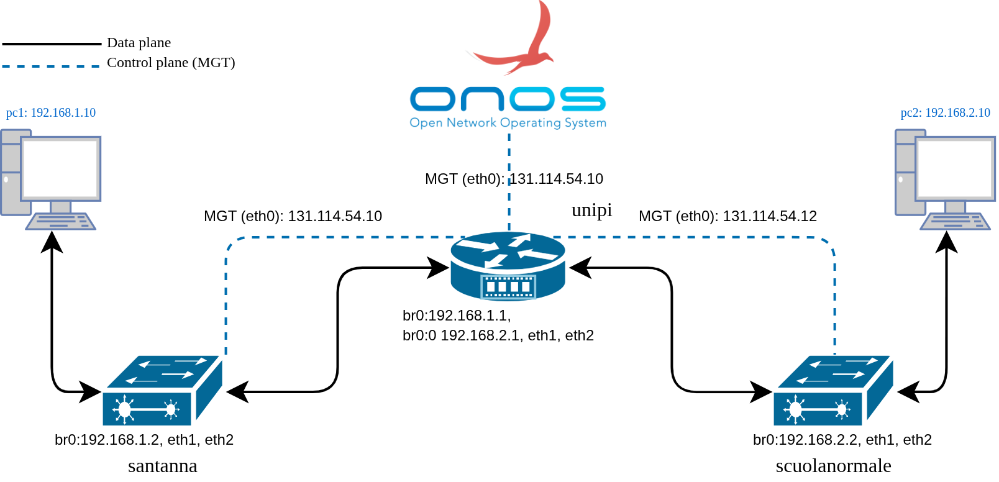

# About

In the [project-folder](../project/) I did a weird project. Maybe you will find stupid things there, but I tried to bring everything in one project so that someone can experience most of the common network functions. But in this project I will try to avail the benefits of an `SDN`. So, there will be no manual configuration.

**_The project is not a success. But it finally identifies a scope of contribution in the `ReactiveForwarding:fwd` app in `ONOS`._** To see what is the scope, please read [this](./test/README.md) documentation and run the lab.

## Topology

1. I have a configurable openVswitch in UniPI which is the parent.

2. Then I have a big switch in San'tAnna.

3. then I have another switch in Scuola'Normale

4. I have 1 pc connected in San'tAnna's switch and 1 in Scuola'Normale's switch

5. I have to configure 192.168.1.0/24 in San'tAnna and 192.168.2.0/24 in Scuola'Normale

6. so it has two different subnets in two switches

7. now the all the switches are connected to a management network 131.114.54.X which is a public IP and can access the internet

8. Basically that management network is my machine and I have ONOS installed in my pc and the router is connected to my deskp using a lan cable.

9. then I have two cable connected San'tAnna and scuola normale switch

10. This is what I am simulating in kathara

