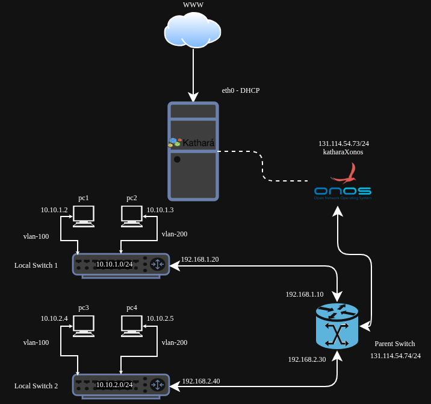

# About

I am trying to test another step ahead. The plan is to create an advance topology with different subnets, vlans and equipments. The topology can be illustrated as below.

## Configuration

1. A server PC (DUMB) that is connected to the internet. One of it's interface (enpX, wlpX) is connected to the internet and the IP is taken from a DHCP server.

2. DUMB has `docker` and `kathara` installed in it. The topology is generated with kathara.

3. The initial connection is: WWW -> DUMB -> Kathara.

### Topology in Kathara

The topology is assumed and it has no practical application. The idea was to test different network functions using `kathara` and `ONOS`.

1. **_ONOS as SDN Controller:_**

   Is a `ONOS` is a kathara object that is generated in the previous test. If you are not familiar with it, please read this [configuration](../../katharaXonos/README.md). Since it is node, it is deployed in kathara collision domain `A` with an IP address `131.114.54.73`.

2. **_Parent Switch:_**

   The `Parent Switch` is assumed as the gateway of the `LAN` and considered to be a `OpenVSwitch` supporting `Openflow v13,v14` protocols. **Think of the parent connection as this: Kathara -> ONOS, ParentSwitch**. It is also in the `Collision Domain: A` with an IP address `131.114.54.74`.

3. **_Local Switch 1:_**

   Is the first switch connected to `Parent Switch` using `Collision Domain B`. Collision domain `B` uses the subnetwork `192.168.1.0/24`. So the connection details are `ParentSwitch:192.168.1.10 -> LocalSwitch_1:192.168.1.20`. This is one of two internal subnetworks configured on the Parent Switch — the point of this lab is to host two different subnets on the same switch. **_But the control domain remains the same on `131.114.54.X`_**.
   1. **_LAN:_**

      Inside `Local Switch 1`, we have another subnetwork setup as `10.10.1.0/24`. Two hosts `PC1` and `PC2` are connected to the switch with the following IP addresses: `PC1:10.10.1.2, PC2:10.10.1.3`. But the trick is that they have two different `vlan` tags. `PC1` has the vlan tag `100` and `PC2` has the vlan tag `200`.

4. **_Local Switch 2:_**

   Is the second switch connected to `Parent Switch` using `Collision Domain C`. Collision domain `C` uses the subnetwork `192.168.2.0/24`. So the connection details are `ParentSwitch:192.168.2.30 -> LocalSwitch_2:192.168.2.40`. This is the second of the two internal subnetworks configured on the Parent Switch. **_But the control domain remains the same on `131.114.54.X`_**.
   1. **_LAN:_**

      Inside `Local Switch 2`, we have another subnetwork setup as `10.10.2.0/24`. Two hosts `PC3` and `PC4` are connected to the switch with the following IP addresses: `PC3:10.10.2.4, PC4:10.10.2.5`. They also have two different `vlan` tags. `PC3` has the vlan tag `100` and `PC4` has the vlan tag `200`. Even though they look the same, they are different local networks in two different switches. **_Note: vlan tags are assigned on the switch access port, here I mentioned them with the hosts just to express the access restriction_**.
