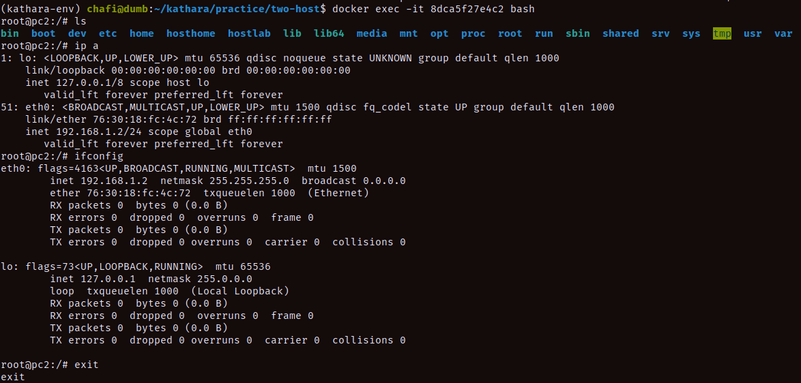
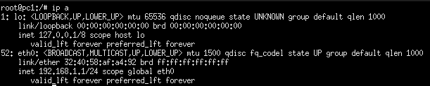

# About

The lab simply connects two host machine together within the same network.

## Configuration

Run the following commands to run the topology:

```bash
#make sure you are in 'two-hosts' folder
python3 -m kathara lstart
```

If you have installed `kathara` successfully, two mini terminal should be spawned where you can ping one host from another.

To clean the configuration run this from the same location:

```bash
python3 -m kathara lclean
# will also clean the containers
```

It should shutdown the hosts and clean the collision domain.

## How the communication is working?

Now, we must investigate how this connectivity is working under the hood.

## The host machine `pc1` and `pc2`

After running the topology if we check the command `docker ps` we will see something like this:

```bash
CONTAINER ID   IMAGE          COMMAND   CREATED          STATUS          PORTS     NAMES
8dca5f27e4c2   kathara/base   "bash"    10 seconds ago   Up 10 seconds             kathara_chafi-zlxaoqgf5wgw6nct6k0prq_pc2_Z6Cw0K0WaucosbwTVKHqQ
d350c5c88c1b   kathara/base   "bash"    10 seconds ago   Up 10 seconds             kathara_chafi-zlxaoqgf5wgw6nct6k0prq_pc1_Z6Cw0K0WaucosbwTVKHqQ
```

This indicates that the host machines are basically docker containers.

## What is inside `pcX`?

If you run the following command `docker inspect 8dca5f27e4c2`, it will load the massive `JSON` file where we can see all the configurations. But you can also run `docker exec -it 8dca5f27e4c2 bash`, which will take you to the terminal. From the terminal we can check the file system, network tools, etc. Basically each of these containers are small lightweight linux systems with all network functionalities.



## How the connectivity is established?

Now that we know, how the hosts are created-next task is to understand the connectivity. As we know docker containers are able to communicate with each other within the same host, we will see what `kathara` is referring as `collision domain`. To begin the inspection, lets start with IP addresses:

1. `pc1` has an IP address `192.168.1.1` which we have defined while configuring the lab. This IP address is completely local to `pc1`.



`pc2` has a similar view with an IP address `192.168.1.2`.

2. When we ping `pc2` from `pc1`, the Linux kernel inside the `pc1` container looks at its own routing table. It sees that `192.168.1.2` is in its local `192.168.1.0/24` subnet. Because it is local, it knows it doesn't need a router—it just needs `pc2's` MAC address.

3. `pc1` generates an ARP request `("Who has 192.168.1.2?")` and sends it out its virtual eth0 interface as a raw Ethernet frame. This is where it hits the `Docker network`. Kathará has plugged the virtual network interfaces of both containers into an isolated virtual Layer-2 LAN (using standard Docker bridge networks or the VDE driver).**_VDE stands for Virtual Distributed Ethernet_**.

4. Because the Docker bridge is acting strictly at `Layer 2`, it does not look inside the packet to read the `192.168.1.2` IP address. It only looks at the `Ethernet MAC` address frame. It sees the ARP frame is a `broadcast`, so it blindly forwards it across the virtual wire to all connected ports (which includes pc2). `pc2` receives it, recognizes its own IP, and replies with its MAC address.

5. Now that `pc1` has `pc2's` MAC address, it wraps the ICMP ping payload inside an Ethernet frame destined for pc2's MAC address and pushes it out eth0. The Docker bridge sees the destination MAC address and simply hands the frame directly over to pc2.

This was all behind the scene. It was all at layer 2.
